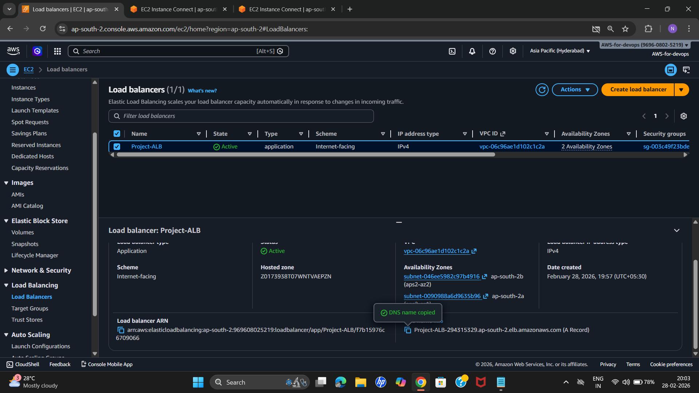
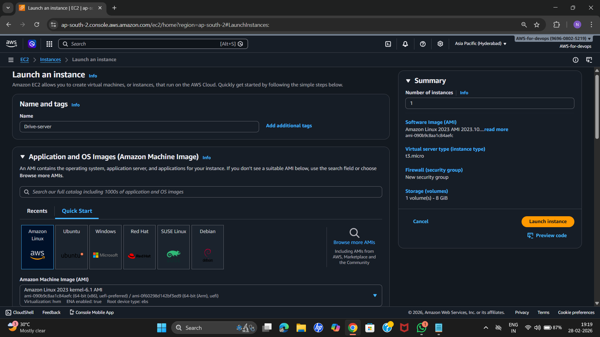
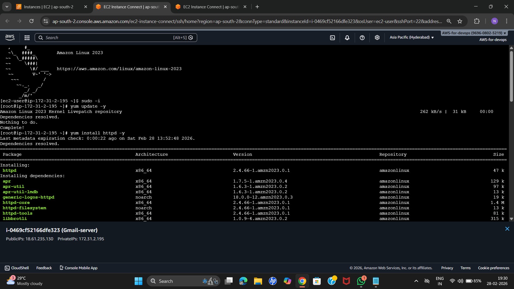
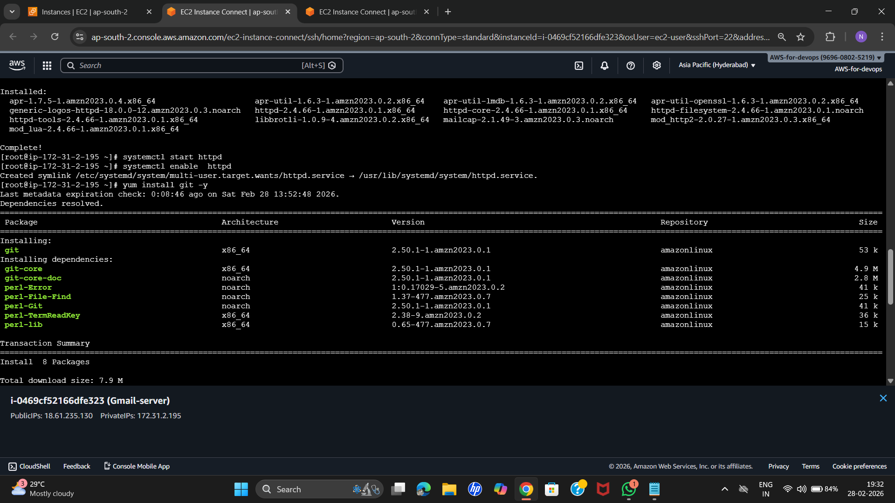
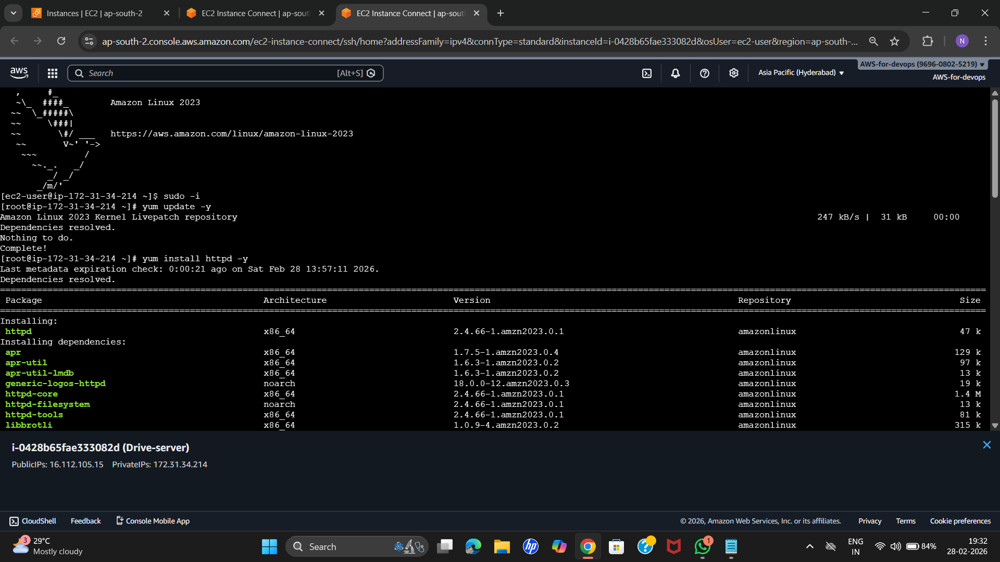
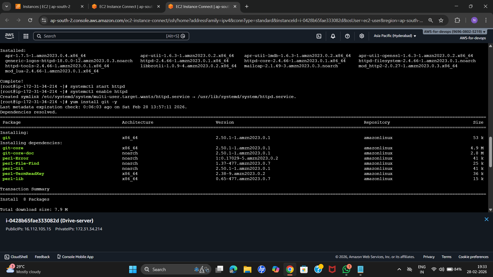
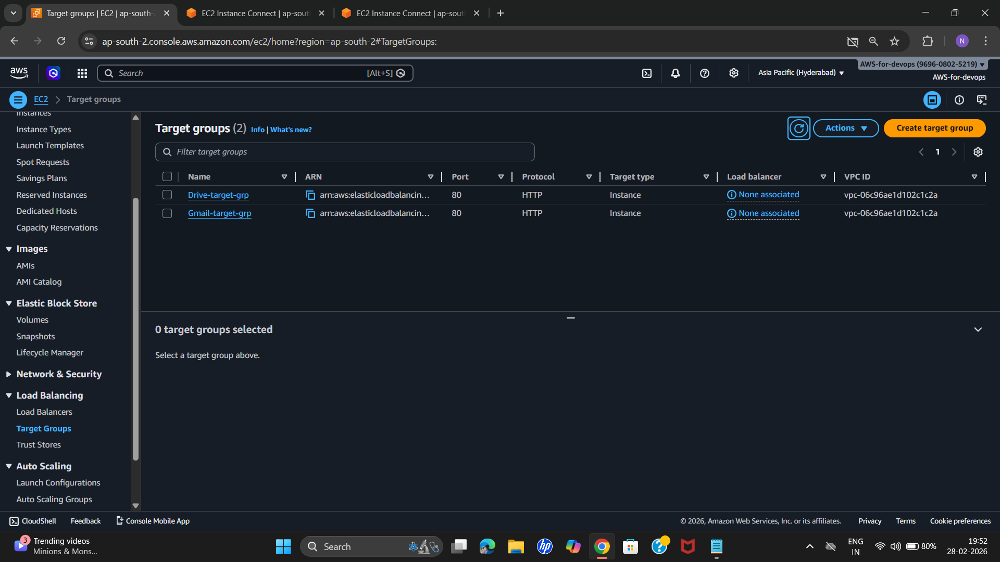
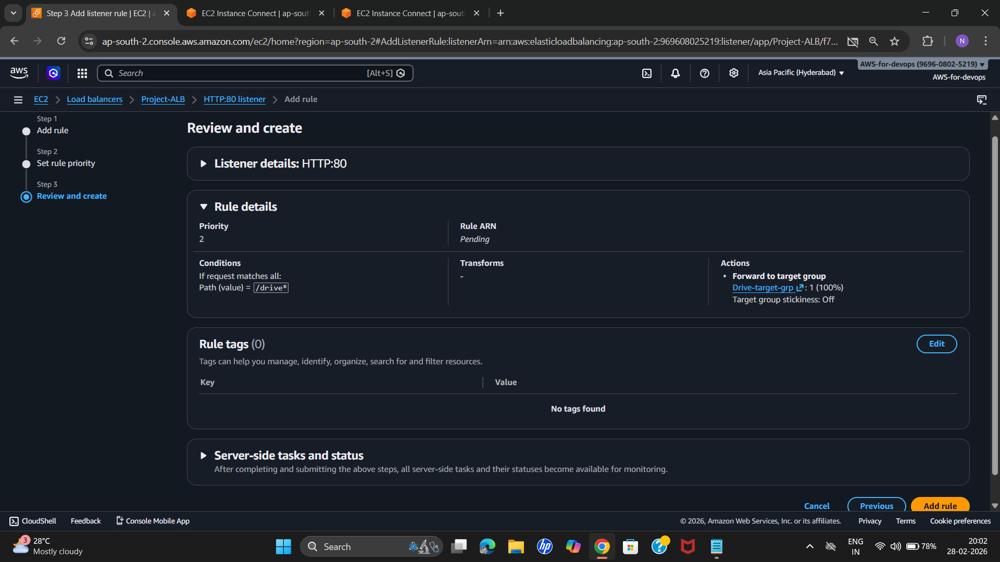
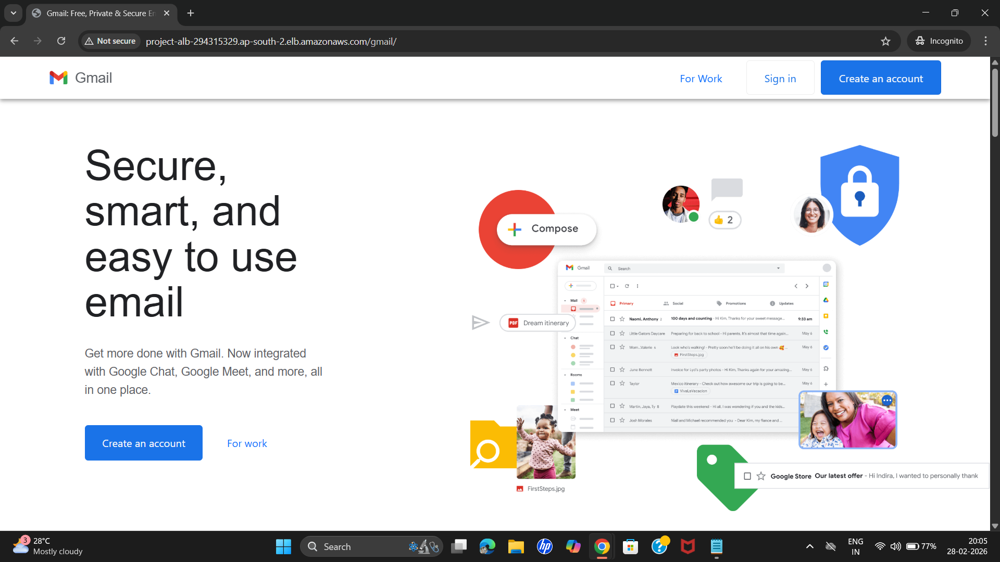
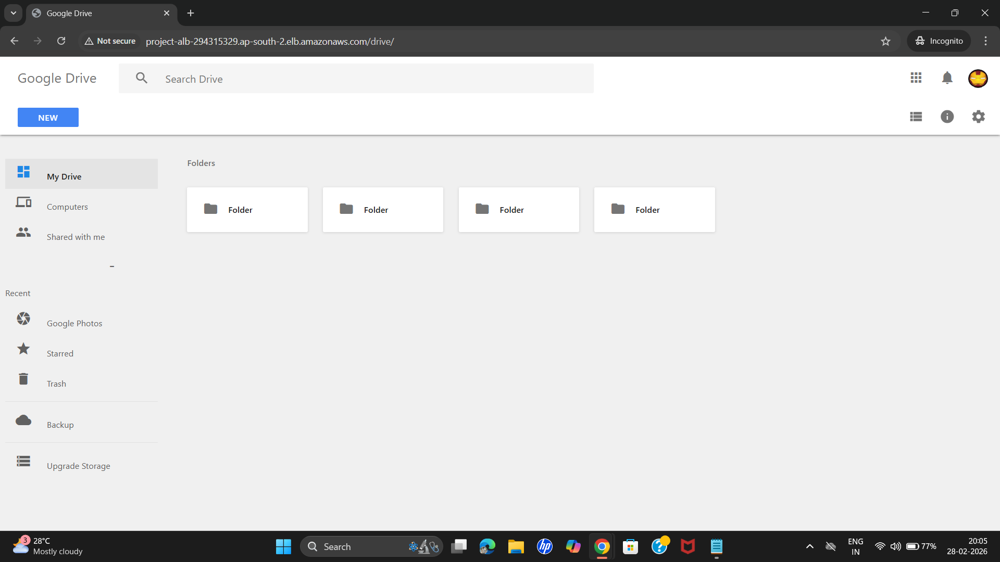

# AWS ALB Path-Based Routing Project

## Project Overview

This project demonstrates **Path-Based Routing using AWS Application Load Balancer (ALB)**.  

Two EC2 instances host two different web applications:

* Gmail Web Page  
* Google Drive Web Page  

Traffic is routed based on URL path using **Application Load Balancer**.

Example:

---

## Architecture

Client → Application Load Balancer → Target Groups → EC2 Instances
User Request
|
v
Application Load Balancer
|

| |
gmail-target-grp drive-target-grp
| |
Gmail EC2 Drive EC2

**Architecture Diagram:**

---

## AWS Services Used

* EC2
* Application Load Balancer
* Target Groups
* Security Groups
* GitHub
* Apache HTTP Server

---

## Project Workflow & Screenshots

### 1. Launch EC2 Instances

**Gmail Instance:**

  

**Drive Instance:**

  

---

### 2. Install Apache Web Server

**Gmail Instance (Step 1 & 2):**

  
  

**Drive Instance (Step 1 & 2):**

  
  

---

### 3. Configure Target Groups

  

---

### 4. Configure Listener Rules

  

---

### 5. Test Applications

**Gmail Application Open:**

  

**Drive Application Open:**

  

---

## Expected Output

Accessing the ALB URL with specific paths routes traffic correctly:

---

